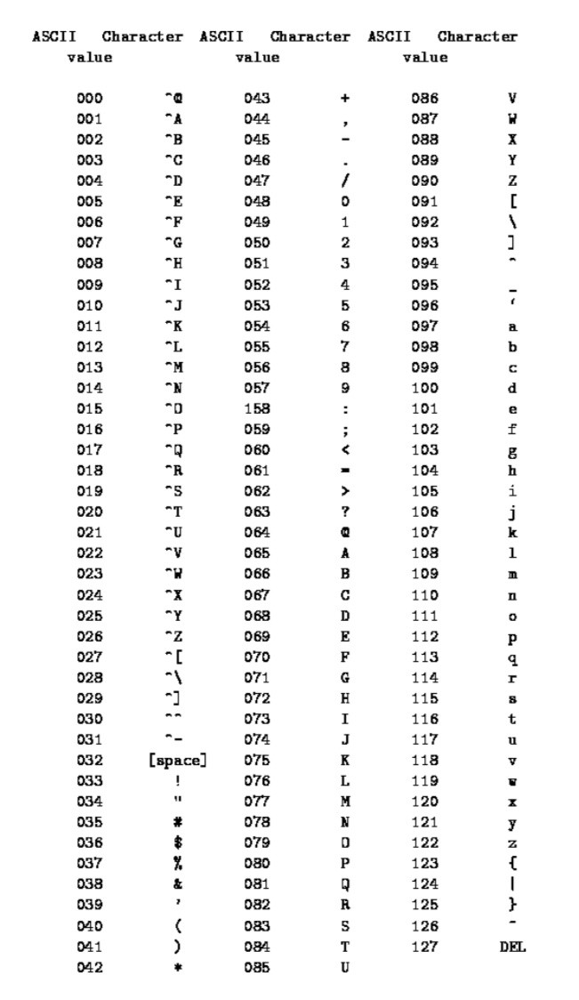

Nicht nur Kriegsherr, sondern auch Krypthograph. Aber wie bringen wir unserem Computer bei Cäsars bester Krypthograph zu sein? 

Zuerst einmal müssen wir Festhalten wie der Alghoritmus funktionieren muss. Wie bei jeder Monoalphabetischen verschlüsselung wird ein Text mit anderen Zeichen verschlüsselt. Cäsar macht es uns hierbei sehr einfach in dem er einfach sagt, dass jeder Buchstabe um den Wert 3 im lateinischen Alphabet verschoben wird. Da der Wert aber einfach zu knacken wäre wollen wir eine Variable die jeden positiven ganzzahligen Wert annehmen kann. Es wird noch klar warum wir den Bereich nicht zwischen 0-25 begrenzen. Was fehlt unserem Alghoritmus jetzt noch fehlt ist eine Lookup Tabelle, hierfür verwenden wir zwei Listen, das Originale Alphabet und das verschobene die dann zusammen zu einem Dictionary verpackt werden.

Was muss der Alghoritmus nun können?
1. Erzeuge eine Liste der Länge 26 mit den Buchstaben A-Z in geordneter Reihenfolge
2. Setze fest wie groß die verschiebung sein soll
3. Erzeuge eine Liste der Länge 26 mit den Buchstaben des verschobenen Alphabets
4. Führe beide Listen zu einem Dictionary zusammen
5. Verschlüssel jeden Buchstaben mit der Verschiebung

***
###### Schritt 1
Als erstes muss nun eine Liste erzeugt werden die die Werte von A-Z beinhält. Hierzu bedienen wir uns eines kleinen Tricks. Die American Standard Code for Information Interchange (Kurz: ASCII) hat 1963 festgelegt wie mit 7-Bits, 128 Buchstaben, Zahlen und Steuerzeichen kodiert werden. Hierzu gibt es in Python die Funktion *chr()* sie gibt für eine eingebene Zahl das dazughörige Zeichen des UTF-8 Zeichensatzes zurück, in der der ASCII zeichensatz inkludiert ist. Da wir aber nicht alle 128 Zeichen brauchen sondern nur die Großbuchstaben von A-Z müssen wir einen kleinen Blick in die folgende ASCII-Tabelle aus dem Artikel [How Computer Print Human Readable Characters : ASCII and UNICODE](https://medium.com/@mittaltanya1999/ascii-and-unicode-9627fdcfabd6) werfen:



Der für unseren Alghoritmus benötigte Zahlenraum liegt zwischen *A=65 & Z=90*. Nun können wir also unsere Liste vollständig erzeugen. Die benötigte *range()* Funktion zählt immer bis zu eingegebenen Wert -1, wie im Artikel [Die Lookup Methode](https://kryptic-storys.de/lookup) zu sehen. Außerdem lässt sich ein Start- & ein Endwert definieren (es gibt auch die möglichkeit anzugeben wie Schritte beim durchlauf benötigt werden). Wir definieren hierfür range mit *range(65, 91)*:

```python
alphabet = [chr(n) for n in range(65, 91)]
# Output
['A', 'B', 'C', 'D', 'E', 'F', 'G', 'H', 'I', 'J', 'K', 'L', 'M', 'N', 'O', 'P', 'Q', 'R', 'S', 'T', 'U', 'V', 'W', 'X', 'Y', 'Z']
```
***
###### Schritt 2
Das festsetzen von Variabeln haben wir jetzt bereits oft genug gemacht. Wir definieren im folgenden eine Variable für die Verschiebung die wir *offset* nennen und eine für den Text mit dem namen *text*. Wichtig ist das der Text nur aus Großbuchstaben besteht (keine Kleinbuchstaben, Sonderzeichen, Steuerzeichen oder Zahlen), da wir im folgenden sonst auf Probleme stoßen. Wie man Text in Python formatiert würde in diesem Fall den Rahmen sprengen. Die Verschiebung ist zurecht auf dem Wert 2, da in der Informatik immer von 0 an gezählt wird. Um also *A* zu *C* zu verschlüsseln müssen wir dem Computer sagen, dass er um 2 Stellen verschieben soll.

```python
offset = 2
text = "CAESAR"
``` 
***
###### Schritt 3
Da jetzt der Offset definiert ist, lässt sich das verschobene Alphabet mit dem original Alphabet erzeugen. Hierzu wird in jedem Schritt ins orginale Alphabet an der verschobenen Stelle geschaut und mit dem Modulo-Operator sichergestellt das nur im Bereich von 0-25 (26 Stellen) geschaut wird. Dafür wir die Formel *(stelle + offset) % "länge des Alphabets"* verwendet. Die länge des Alphabets lässt sich über *len(alphabet)* herausfinden. Die verschobene Liste für den *offset=3* sieht also wie folgt aus:

```python
shifted_alphabet = [
	alphabet[(n + offset) % len(alphabet)]
	for n in range(len(alphabet))
]
# Output
['C', 'D', 'E', 'F', 'G', 'H', 'I', 'J', 'K', 'L', 'M', 'N', 'O', 'P', 'Q', 'R', 'S', 'T', 'U', 'V', 'W', 'X', 'Y', 'Z', 'A', 'B']
``` 
***
###### Schritt 4
Wie Mächtig die mathematische Notation von Mengen ist wird klar wenn wir uns die Umsetzung von Schritt 4 anschauen. Python bietet um durch 2 (oder mehr) Listen gleichzeitig zu iterieren die Funktion *zip()* an. Sie gibt für jede Iteration in unserem Beispiel 2 Werte, nämlich einen aus jeder der beiden Listen zurück mit denen wir arbeiten können. Iteration ist der Prozess des Wiederholens, iterieren das dazugehörige Verb.

Definiert werden jetzt zwei Dictionaries. Das Erste hat als Schlüssel den Buchstaben des Klaralphabets und als Wert den des verschobenen. Das Zweite definiert sich genau entgegengesetzt, also der Schlüssel ist der des verschobenen Alphabets und der Wert der des Klaralphabets. Damit auch wieder entschlüsselt werden kann.

```python
encoder = {
	key : value
	for key, value in zip(alphabet, shifted_alphabet)
}
# Output
{
'A': 'C', 'B': 'D',
'C': 'E', 'D': 'F',
'E': 'G', 'F': 'H',
'G': 'I', 'H': 'J',
'I': 'K', 'J': 'L',
'K': 'M', 'L': 'N',
'M': 'O', 'N': 'P',
'O': 'Q', 'P': 'R',
'Q': 'S', 'R': 'T',
'S': 'U', 'T': 'V',
'U': 'W', 'V': 'X',
'W': 'Y', 'X': 'Z',
'Y': 'A', 'Z': 'B',
}

decoder = {
	value : key # Schlüssel & Wert einfach vertauschen
	for key, value in zip(alphabet, shifted_alphabet)
}
# Output
{
'C': 'A', 'D': 'B',
'E': 'C', 'F': 'D',
'G': 'E', 'H': 'F',
'I': 'G', 'J': 'H',
'K': 'I', 'L': 'J',
'M': 'K', 'N': 'L',
'O': 'M', 'P': 'N',
'Q': 'O', 'R': 'P',
'S': 'Q', 'T': 'R',
'U': 'S', 'V': 'T',
'W': 'U', 'X': 'V',
'Y': 'W', 'Z': 'X',
'A': 'Y', 'B': 'Z',
}
```
***
###### Schritt 5
Da nun beide Lookup Tabelle stehen wird es Zeit den Text zu verschlüsseln und um zu prüfen ob alles richtig funktioniert wieder zu entschlüsseln. Hierfür wir jediglich jeder einzelne Buchstabe genommen und geschaut welchen Wert er in der jeweiligen Tabelle hat. Im Anschluss daran werden alle Buchstaben mit der Methode *join()* wieder zu einem Text zusammengefügt.

```python
# text verschlüsseln
cipher = str().join([
	encoder[charakter]
	for charakter in text
])
# Output
'ECGUGT'

# cipher entschlüsseln
text = str().join([
	decoder[charakter]
	for charakter in cipher
])
# Output
'CAESER'
```
***
Nach dieser sehr ausführlichen Variante gibt es nun das unkommentierte Beispiel, wie alles zu einer Funktion gepackt wird die anhand des *encode*-Wertes bestimmt ob der Text verschlüsselt oder entschlüsselt wird.
```python
# Funktion mit Eingabewerten Definieren
def caesar(text: str, offset: int, encode: bool) -> str:
	# Klar Alphabet erzeugen 
	alphabet = [chr(n) for n in range(65, 91)]

	# Verschobenes Alphabet erzeugen
	shifted_alphabet = [
		alphabet[(n + offset) % len(alphabet)]
		for n in range(len(alphabet))
	]

	# Lookup Tabelle erzeugen
	table = {
		key : value
		for key, value in zip(alphabet, shifted_alphabet)
	} if encode else {
		value : key 
		for key, value in zip(alphabet, shifted_alphabet)
	}

	# Lookup ausführen
	cipher = str().join([
		table[charakter]
		for charakter in text
	])

	return cipher

text = "BLACKMAGIC"
caesar(text, 2, True)

# Output
'DNCEMOCIKE'

``` 